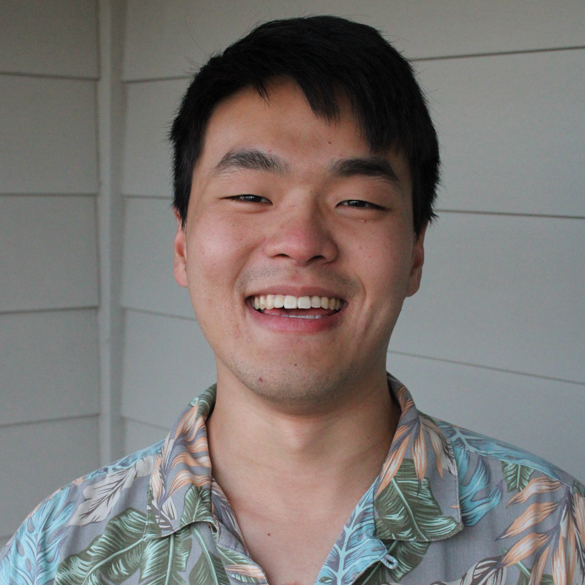

 

# David Chu（朱崇亞）

*EECS PhD, UC Berkeley (since Fall 2020)*  
*Computer Science B.S., Cornell University (Dec 2019)*

[```Google Scholar```](https://scholar.google.com/citations?user=7USKEJwAAAAJ&hl=en) [```Github```](https://github.com/davidchuyaya) [```CV```](https://docs.google.com/viewer?url=https://docs.google.com/document/d/1oZ8qqCvXfJUhQ5LPVVmh1qrv9hrbS2k187Py75Q-zuA/export?format=pdf)  
[```Email```](mailto:thedavidchu@berkeley.edu) [```YouTube```](https://www.youtube.com/channel/UCTN5jkopaVtABbd5nTuBFvA) [```Twitter```](https://twitter.com/davidchuyaya) 

I'm currently pursuing a PhD in **distributed systems**, co-advised by [Joe Hellerstein](https://dsf.berkeley.edu/jmh/index.html) and [Natacha Crooks](https://nacrooks.github.io/) in the [Sky Computing Lab](https://sky.cs.berkeley.edu/projects/). I'm excited about automating what we find hardest about distributed systems: creating new protocols.  
Instead of creating individual bespoke protocols from scratch, I believe we should: 
1. **Automatically optimize distributed protocols.** Traditionally, depending on the performance requirements, entirely new protocols would be created from scratch, requiring expertise and often resulting in correctness errors. We should instead take existing, well-studied protocols, like Paxos, and optimize them automatically using a set of small, provably-correct rewrites. This is my goal with [Hydro](https://hydro.run/).
2. **Automatically provide programs with resistance to rollback attacks**, a form of attack that programs running on TEEs (Trusted Execution Environments, like Intel SGX) are vulnerable to. Traditionally, new implementations of databases and replication protocols would be created from scratch to address rollback attacks. We should instead provide a simple lift-and-shift experience to developers moving their applications to TEEs. This is my goal with [Rollbaccine](https://github.com/davidchuyaya/rollbaccine).  

In my spare time, I love playing badminton, teaching, and listening to classical music. 
[Here's a video](https://youtu.be/kvjLjtEr0AQ) of my senior recital at Cornell, where I performed Brahms Ballades Op. 10, Thomas Ades' _Darknesse Visible_, and Beethoven's _Appassionata_ Op. 57, one of my favorite sonatas.


<br>
<br>

## Publications
**Rollbaccine: Herd Immunity Against Rollbacks for TEEs (WIP)**  
[```Video```](https://www.youtube.com/watch?v=RXqR5Rjn1co) [```Poster```](https://docs.google.com/presentation/d/11BPj-w6UJu3JCIqu4uKLambG6yWf4I3yruRDKk5K1CU/edit?usp=sharing) [```Github```](https://github.com/davidchuyaya/rollbaccine)  
David Chu, Soujanya Ponnapalli, Chris Liu, Eddy Ashton, Amaury Chamayou, Natacha Crooks, Heidi Howard  
Presented at ACM SOSP 2023 Poster Session  

[Bigger, not Badder: Safely Scaling BFT Protocols](https://dl.acm.org/doi/10.1145/3642976.3653033)  
[```Github```](https://github.com/rithvikp/autocomp)  
David Chu, Chris Liu, Natacha Crooks, Joe Hellerstein, & Heidi Howard  
*PaPoC 2024*  

[Optimizing Distributed Protocols with Query Rewrites](https://dl.acm.org/doi/10.1145/3639257)  
[```Video```](https://youtu.be/lEvFoeD8UUk) [```Github```](https://github.com/rithvikp/autocomp) [```Technical Report```](https://arxiv.org/abs/2404.01593)  
David Chu, Rithvik Panchapakesan, Shadaj Laddad, Lucky Katahanas, Chris Liu, Kaushik Shivakumar, Natacha Crooks, Joe Hellerstein, & Heidi Howard  
ACM SOSP 2021 Student Research Competition (Winner)  
*SIGMOD 2024*  

[Take Out the TraChe: Maximizing (Tra)nsactional Ca(che) Hit Rate](https://www.usenix.org/system/files/osdi23-cheng.pdf)  
Audrey Cheng, David Chu, Terrance Li, Jason Chan, Natacha Crooks, Joseph M. Hellerstein, Ion Stoica, & Xiangyao Yu  
*OSDI 2023*

[Scalog: Seamless Reconfiguration and Total Order in a Scalable Shared Log](https://www.usenix.org/conference/nsdi20/presentation/ding)  
Cong Ding, David Chu, Evan Zhao, Xiang Li, Lorenzo Alvisi, & Robbert Van Renesse  
*NSDI 2020*

[Reliable, Efficient Recovery for Complex Services with Replicated Subsystems](https://ieeexplore.ieee.org/document/9153445)  
[```Free link```](https://research.cs.cornell.edu/projects/Quicksilver/public_pdfs/complex-restart.pdf)  
Edward Tremel, Sagar Jha, Weijia Song, David Chu, & Ken Birman  
*DSN 2020*

<br>
<br>

## Media Coverage
9/20/24 [Blog post](https://muratbuffalo.blogspot.com/2024/09/hpts24-day-1-part-2.html) from Murat Demirbas on my HPTS gong show talk (at the end of the article). Thanks Murat!  
6/28/24 [Blog post](https://muratbuffalo.blogspot.com/2024/06/optimizing-distributed-protocols-with.html) from Murat Demirbas on our SIGMOD 24 paper: Optimizing Distributed Protocols with Query Rewrites

<br>
<br>

## Research Activity
## 2025
1/7 I was awarded the RDI Frontier Fellows Award!

### 2024
11/14 [Invited talk](https://www.youtube.com/watch?v=qmVzvbtQuD0) at Northeastern  
11/13 Invited talk at Brown  
11/12 Invited talk at MIT  
9/16 [My talk](https://youtu.be/CK_pK3Mh3fU) on Yu-Gi-Oh! and (*Optimizing Distributed Protocols with Query Rewrites*) was voted the best gong show talk at HPTS!  
7/10 Poster presentation: Ongoing work after (*Optimizing Distributed Protocols with Query Rewrites*) at OSDI 2024  
6/13 Paper presentation: (*Optimizing Distributed Protocols with Query Rewrites*) at SIGMOD 2024  
4/22 Paper presentation: (*Bigger, not Badder: Safely Scaling BFT Protocols*) at PaPoC 2024 (EuroSys)  
3/20 Invited talk: (*Rollbaccine: Herd Immunity Against Rollbacks for TEEs*) at Intel  
3/11 Acceptance: (*Bigger, not Badder: Safely Scaling BFT Protocols*) will be published at PaPoC 2024 

### 2023  
9/28 Poster presentation: (*Rollbaccine: Herd Immunity Against Rollbacks for TEEs*) at SOSP 2023  
9/20 Acceptance: (*Optimizing Distributed Protocols with Query Rewrites*) will be published at SIGMOD 2024 with minor revisions  

<br>
<br>

## Awards
2025 RDI Frontier Fellows Award  
2024 [HPTS Best Gong Show Talk](https://youtu.be/CK_pK3Mh3fU)  
2024 UC Berkeley EECS Evergreen Award for Undergraduate Researcher Mentoring  
2023 UC Berkeley EECS Award for Undergraduate Researcher Mentoring  
2023 UC Berkeley SRC-URO Award  
2022 UC Berkeley SRC-URO Award  
2021 UC Berkeley SRC-URO Award  
2021 ACM SOSP Student Research Competition Winner  

<br>
<br>

## Service
2024 SIGMOD ARI Reviewer  

<br>
<br>

## Extra-Curricular Projects
### Cornell Design & Tech Initiative
[DTI](https://www.cornelldti.org/) was a project team focused on using technology to generate community impact. We curated events to educate students on web and mobile technologies; at the same time, we worked as a team to design apps and websites with the goal of student support.
My proudest achievement is the establishment of biweekly DevSeshes and onboarding sessions for developers on the team, in which I taught developers on the team upcoming technologies such as React, Firebase, and Android/iOS programming.

Here are some projects I've worked on as part of the team.

> #### ~~CUEvents~~ ~~cue~~ eve
> <a href="https://www.cuevents.org/"></a>
> 
> [```Showcase```](https://www.cornelldti.org/projects/events) [```Frontend & Backend```](https://github.com/cornell-dti/events-backend-2.0) [```iOS```](https://github.com/cornell-dti/events-manager-ios) [```Android```](https://github.com/cornell-dti/events-manager-android)  
> A platform to gather all events on campus. I was a front-end developer, then product manager on this subteam. I've helped program all aspects of the app, including its Android (Java), iOS (Swift), backend (Django), and frontend (React) components. It's currently in beta.

> #### Cornell Orientation
> 
> 
> [```Backend```](https://github.com/cornell-dti/o-week-backend) [```iOS```](https://itunes.apple.com/us/app/cu-orientation/id1244530142?mt=8) [```Source```](https://github.com/cornell-dti/o-week-ios) [```Android```](https://play.google.com/store/apps/details?id=com.cornellsatech.o_week&hl=en_US) [```Source```](https://github.com/cornell-dti/o-week-android)  
> An app to provide students with personalized events for orientation week based on the college they're enrolled in, with built-in search, filters, and directions. I created the Android (Java) and iOS (Swift) portions of the app, as well as rewriting the backend from Django to Firebase.

<br>

### Personal projects
> #### And My Code Is Ended
> 
> 
> [```Android```](https://play.google.com/store/apps/details?id=com.davidchu.andmycodeisended) [```Source```](https://github.com/davidchuyaya/and-my-code-is-ended-android) [```Backend```](https://github.com/davidchuyaya/and-my-code-is-ended-backend)  
> An app to wake the user up with a line of code. If you're tired of constantly checking when your code is finished, add that line of code to your script, go to sleep, and be woken up by the app!

> #### Visit Once
> 
>
> [```Chrome Store```](https://chrome.google.com/webstore/detail/once/koibjjcabhgmipfagkmaccgjkcokolbn) [```Source```](https://github.com/davidchuyaya/VisitOnce)  
> A chrome extension that limits selected websites to a single visit a day, created to maximize productivity.

> #### NSHS Guide
> 
>
> [```Frontend & Backend```](https://github.com/NSHS-App-Design-Team/NSHS-Guide-Website) [```iOS```](http://itunes.apple.com/us/app/nshs-guide/id998228606?ls=1&mt=8) [```Source```](https://github.com/NSHS-App-Design-Team/NSHS-Guide-iOS) [```Android```](https://play.google.com/store/apps/details?id=com.nshsappdesignteam.nshsguide) [```Source```](https://github.com/NSHS-App-Design-Team/NSHS-Guide-Android)  
> An iOS, Android app + website for students at Newton South High School to check which classes they can skip for that day. It's integrated into each students' daily schedule so they are each alerted which of their teachers are absent. The app read emails sent by the principal's secretary, parsed it with PHP, stored the data in MySQL, and beamed messages to users detailing their updated schedule. I was the sole Android and iOS developer on the app, working with [Eric Lin](https://github.com/EricSihaoLin), the backend developer. I also rewrote the backend in PHP and frontend in Polymer.js, pushed by Google as an Angular alternative at the time.
>
> #### Froggy Math
> 
>
> [```iOS source```](https://github.com/davidchuyaya/Froggy-Math/tree/main)  
> An iOS app to help my fiance drill mental math skills.
>
> #### It's time to [insert your thing]
>
> [```Website```](https://davidchuyaya.github.io/) [```Source```](https://github.com/davidchuyaya/davidchuyaya.github.io)  
> A website to create your custom "It's time to duel" sound.
