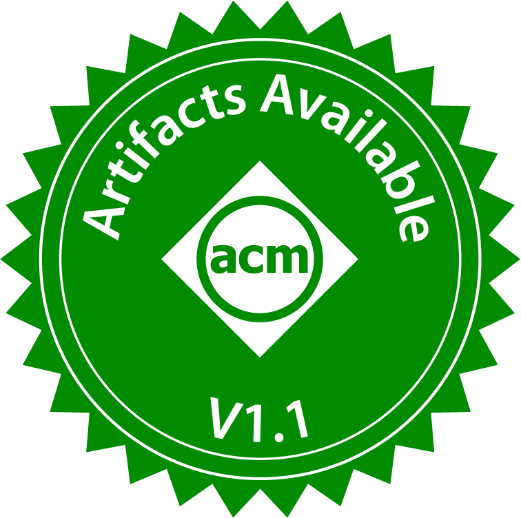
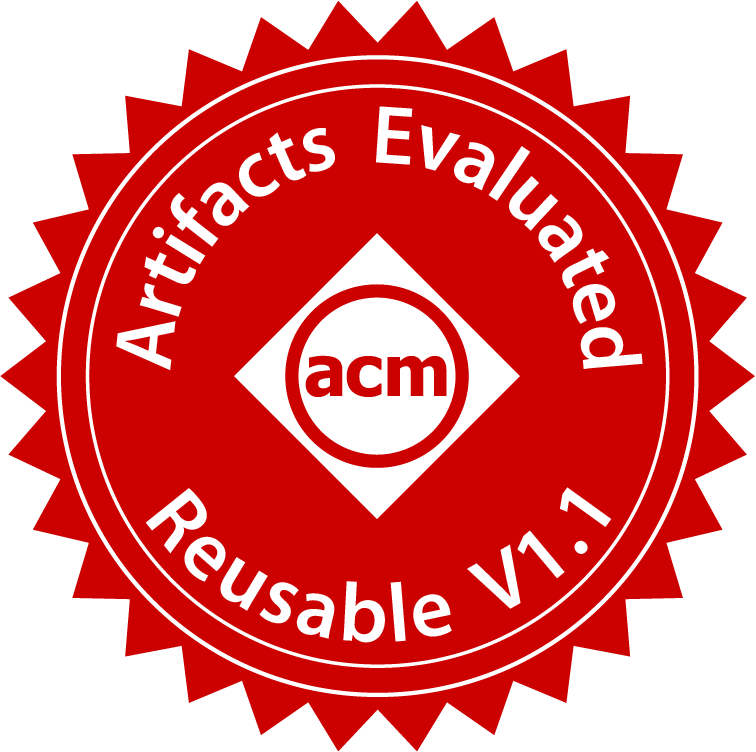
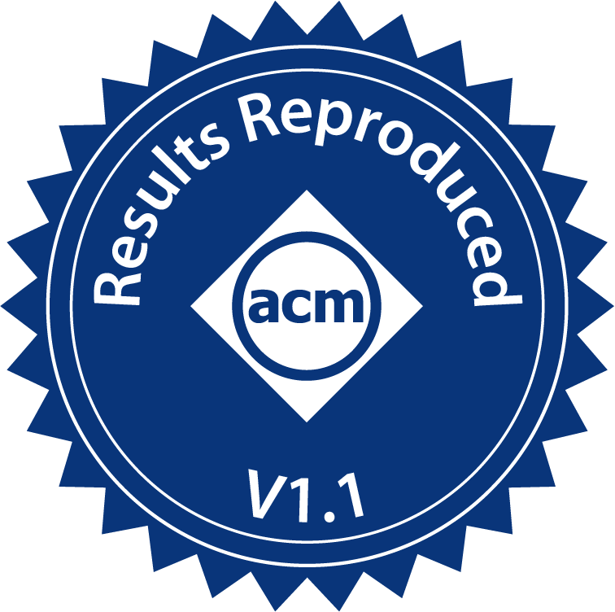

I'm a PhD student at UC Berkeley in the [Sky Computing Lab](https://sky.cs.berkeley.edu/projects/), co-advised by [Joe Hellerstein](https://dsf.berkeley.edu/jmh/index.html) and [Natacha Crooks](https://nacrooks.github.io/). My research goal is to **enable the rapid evolution of distributed systems without sacrificing correctness**.

I am a member of the [Hydro project](https://hydro.run/), a Rust framework for writing correct and performant distributed systems. This initiative began at Berkeley and is currently gaining adoption within AWS.

In my spare time, I love playing badminton, teaching, and listening to classical music. 
[Here's a video](https://youtu.be/kvjLjtEr0AQ) of my senior recital at Cornell, where I performed Brahms Ballades Op. 10, Thomas Ades' _Darknesse Visible_, and Beethoven's _Appassionata_ Op. 57, one of my favorite sonatas.

 

## Publications
DistOptimize: Automatic Optimization of Distributed Protocols  
[Github](https://github.com/hydro-project/hydro-optimize)  
**David Chu McElroy**, Shadaj Laddad, Lucky Katahanas, Mingwei Samuel, Octavio Lomeli, Natacha Crooks, Joe Hellerstein, & Mohsen Lesani  
*Under Submission*  

[Rollbaccine: Herd Immunity Against Rollbacks for TEEs](https://dl.acm.org/doi/10.1145/3786693)  
[Video](https://www.youtube.com/watch?v=RXqR5Rjn1co) / [Poster](https://docs.google.com/presentation/d/1NmzPcrASh7UhKeUgRN2KDFR5kGKRjPVbrQEgmOT73ME/edit?usp=sharing) / [Github](https://github.com/davidchuyaya/rollbaccine) / [Technical Report](https://arxiv.org/abs/2505.04014)  
**David Chu**, Aditya Balasubramanian, Dee Bao, Natacha Crooks, Heidi Howard, Lucky Katahanas, & Soujanya Ponnapalli  
*SIGMOD 2026*  

[Bigger, not Badder: Safely Scaling BFT Protocols](https://dl.acm.org/doi/10.1145/3642976.3653033)  
[Poster](https://docs.google.com/presentation/d/1v4DuoYuByMY9aT148zGBopJqlJtx0ZaIJFCpC2cbqe0/edit?usp=sharing) / [Github](https://github.com/rithvikp/autocomp)  
**David Chu**, Chris Liu, Natacha Crooks, Joe Hellerstein, & Heidi Howard  
*PaPoC 2024*  

[Optimizing Distributed Protocols with Query Rewrites](https://dl.acm.org/doi/10.1145/3639257)     
[Video](https://youtu.be/lEvFoeD8UUk) / [Poster](https://docs.google.com/presentation/d/1rjLTfHUV_acuOgESaB_rQXxjOUEinEGLAnJajveENfU/edit?usp=sharing) / [Github](https://github.com/rithvikp/autocomp) / [Technical Report](https://arxiv.org/abs/2404.01593)  
**David Chu**, Rithvik Panchapakesan, Shadaj Laddad, Lucky Katahanas, Chris Liu, Kaushik Shivakumar, Natacha Crooks, Joe Hellerstein, & Heidi Howard  
SOSP 2021 Student Research Competition (Winner)  
*SIGMOD 2024*  

[Take Out the TraChe: Maximizing (Tra)nsactional Ca(che) Hit Rate](https://www.usenix.org/system/files/osdi23-cheng.pdf)  
Audrey Cheng, **David Chu**, Terrance Li, Jason Chan, Natacha Crooks, Joseph M. Hellerstein, Ion Stoica, & Xiangyao Yu  
*OSDI 2023*

[Scalog: Seamless Reconfiguration and Total Order in a Scalable Shared Log](https://www.usenix.org/conference/nsdi20/presentation/ding)  
Cong Ding, **David Chu**, Evan Zhao, Xiang Li, Lorenzo Alvisi, & Robbert Van Renesse  
*NSDI 2020*

[Reliable, Efficient Recovery for Complex Services with Replicated Subsystems](https://ieeexplore.ieee.org/document/9153445)  
[Free link](https://research.cs.cornell.edu/projects/Quicksilver/public_pdfs/complex-restart.pdf)  
Edward Tremel, Sagar Jha, Weijia Song, **David Chu**, & Ken Birman  
*DSN 2020*

 

## Recent News
6/3/26 I presented Rollbaccine at SIGMOD 2026  
2/26/26 I was awarded the [MongoDB PhD Fellowship](https://www.mongodb.com/company/blog/innovation/announcing-the-2026-mongodb-phd-fellowship-recipients)!  
10/20/25 I was invited to talk at Princeton SNS Group  
6/22/25 I presented Rollbaccine at Confidential Computing Summit 2025  
1/7/25 I was awarded the RDI Frontier Fellows Award!  

 

## Awards & Service
2026 [MongoDB PhD Fellowship](https://www.mongodb.com/company/blog/innovation/announcing-the-2026-mongodb-phd-fellowship-recipients)  
2025 RDI Frontier Fellows Award  
2024 SIGMOD ARI Reviewer  
2024 [HPTS Best Gong Show Talk](https://youtu.be/CK_pK3Mh3fU)  
2023-2026 UC Berkeley EECS Evergreen Graduate Research Award  
2021-2023 UC Berkeley SRC-URO Award  
2021 ACM SOSP Student Research Competition Winner  

 

Check out my old projects [here]({{ "/old/" | relative_url }})!
